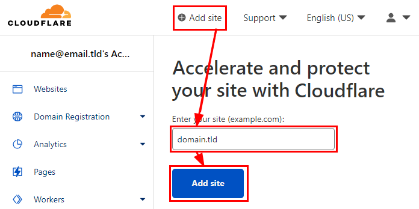
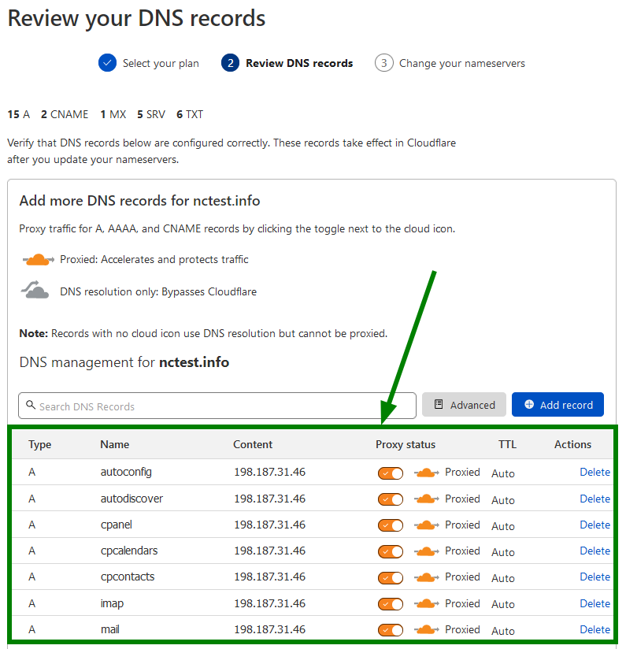
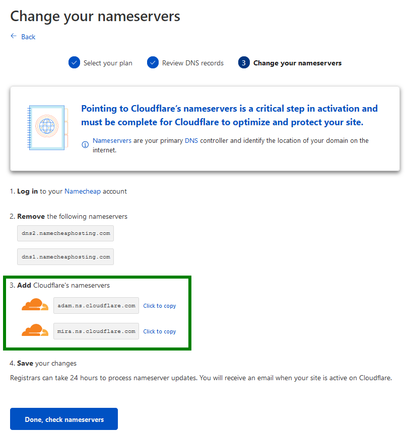
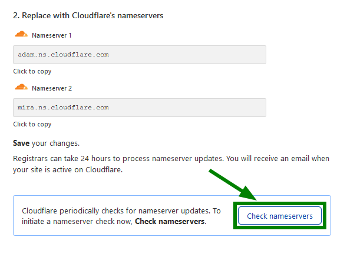
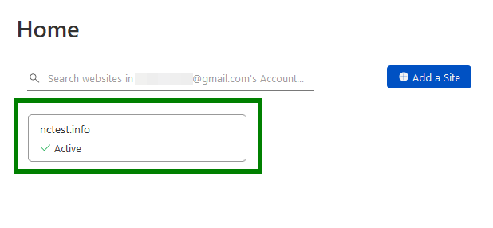
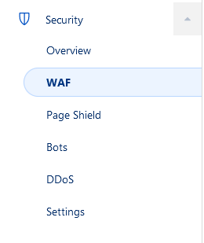
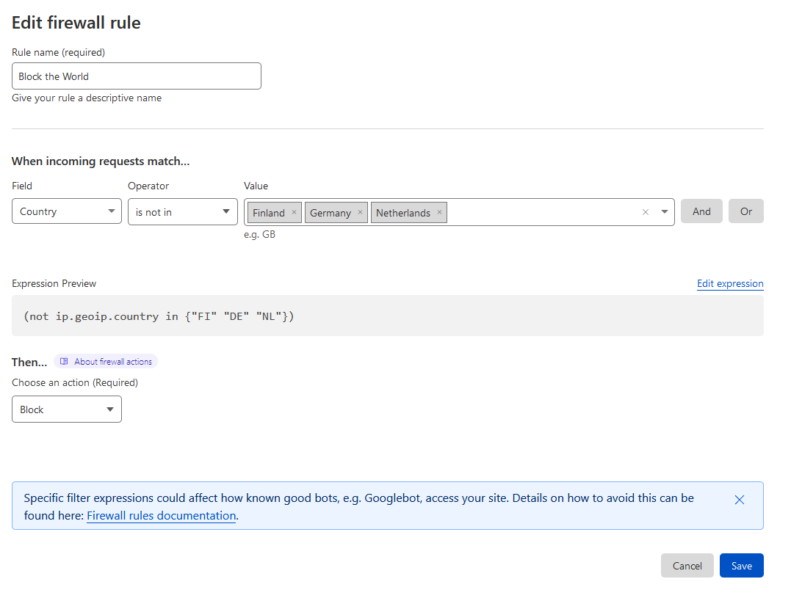
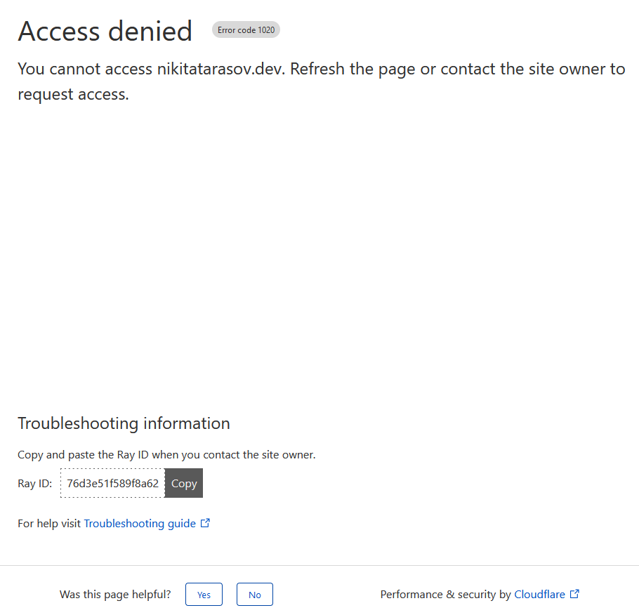

# Introduction
Cloudflare is a global network of edge servers  
When you add your application to Cloudflare, we use this edge network to sit in between requests and your origin server
  
This position allows us to do several things — speeding up content delivery and user experience ( [CDN](https://www.cloudflare.com/learning/cdn/what-is-a-cdn/) ), protecting your website from malicious activity ( [DDoS](https://www.cloudflare.com/learning/ddos/what-is-a-ddos-attack/), [Firewall](https://www.cloudflare.com/learning/ddos/glossary/web-application-firewall-waf/) ), routing traffic (Load balancing, Waiting Room), and more.

# Point a Domain to Cloudflare
Create an account on [Cloudflare.com](https://dash.cloudflare.com/sign-up).

- Click on Add site and enter your domain name to add it to Cloudflare:
  

- On the next screen, you will see the list of your existing host records. Be sure to double-check if the specified DNS records match the ones you previously had.  
  
If records shown in the list are correct, you can scroll down and click Continue.

- You will see nameservers (NS), needed for your domain to work with Cloudflare. Copy the values and change the nameservers at your domain registrar.
  
After you specify new DNS records, propagation will start which can take up to 24 hours to fully complete.

- Once the nameservers are set up, return to the Cloudflare tab and click Check nameservers:
  
If the nameservers have been successfully updated, you will see the Active status:
  

# Cloudflare WAF (Web Application Firewall)
The Cloudflare Web Application Firewall (WAF) provides both automatic protection from vulnerabilities and the flexibility to create custom rules.

In your Cloudflare Dashboard:

- Select the *WAF* Sub-Menu under the Security Menu  


- Create your Rules, who can and who can't access your domain  

In this example only users from ```Finland```, ```Germany``` and ```Netherlands``` can access the domain.

- Users from other Countries on the other hand will see the following site/message from cloudflare  


# Cloudflare IP Ranges
From now on the only IP's that are directly connecting to the domain are the ones from cloudflare
| [IPv4](https://www.cloudflare.com/ips-v4) | [IPv6](https://www.cloudflare.com/ips-v6) |
|-------------------------------------------|-------------------------------------------|
| 103.21.244.0/22                           | 2400:cb00::/32                            |
| 103.22.200.0/22                           | 2606:4700::/32                            |
| 103.31.4.0/22                             | 2803:f800::/32                            |
| 104.16.0.0/13                             | 2405:b500::/32                            |
| 104.24.0.0/14                             | 2405:8100::/32                            |
| 108.162.192.0/1                           | 2a06:98c0::/29                            |
| 131.0.72.0/22                             | 2c0f:f248::/32                            |
| 141.101.64.0/18                           |                                           |
| 162.158.0.0/15                            |                                           |
| 172.64.0.0/13                             |                                           |
| 173.245.48.0/20                           |                                           |
| 188.114.96.0/20                           |                                           |
| 190.93.240.0/20                           |                                           |
| 197.234.240.0/2                           |                                           |
| 198.41.128.0/17                           |                                           |
|-------------------------------------------|-------------------------------------------|

---
Sources:  
[What is Cloudflare?](https://developers.cloudflare.com/fundamentals/get-started/concepts/what-is-cloudflare/)  
[How Cloudflare works](https://developers.cloudflare.com/fundamentals/get-started/concepts/how-cloudflare-works/)  
[How to set up DNS records for your domain in Cloudflare account](https://www.namecheap.com/support/knowledgebase/article.aspx/9607/2210/how-to-set-up-dns-records-for-your-domain-in-cloudflare-account/)  
[How to point a domain to Cloudflare](https://support.hostinger.com/en/articles/4741545-how-to-point-a-domain-to-cloudflare)  
[Step 1: Adding your domain to Cloudflare](https://community.cloudflare.com/t/step-1-adding-your-domain-to-cloudflare/64309)  
[IP Ranges](https://www.cloudflare.com/ips/)


