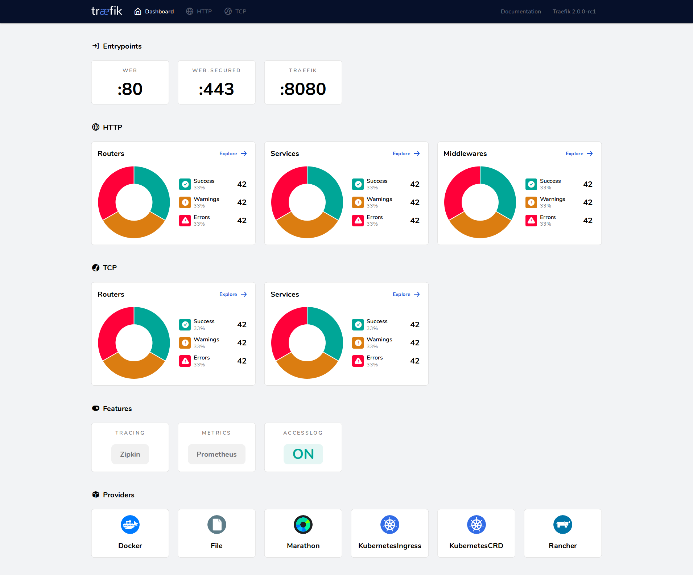

# {{ $frontmatter.title }}

## Introduction

Traefik (pronounced traffic) is a modern HTTP reverse proxy and load balancer that makes deploying microservices easy.
Traefik integrates with your existing infrastructure components (Docker, Swarm mode, Kubernetes, Consul, Etcd, Rancher
v2, Amazon ECS, ...) and configures itself automatically and dynamically. Pointing Traefik at your orchestrator should
be the only configuration step you need.

## Docker Compose

To run Traefik, with Docker you need to create a `docker-compose.yml` file. The following example shows a basic
configuration:

``` yaml
version: '3.3'

services:
  traefik:
    # The official v2 Traefik docker image
    image: traefik:v2.10
    command:
      - "--log.level=DEBUG"
      - "--api.insecure=true"
      - "--providers.docker=true"
      - "--providers.docker.exposedbydefault=false"
      - "--entrypoints.websecure.address=:443"
      - "--certificatesresolvers.myresolver.acme.tlschallenge=true"
      - "--certificatesresolvers.myresolver.acme.email=${ACME_EMAIL}"
      - "--certificatesresolvers.myresolver.acme.storage=/letsencrypt/acme.json"
    ports:
      - "443:443"
      - "8080:8080"
    volumes:
      - "/var/run/docker.sock:/var/run/docker.sock:ro"
      - "./letsencrypt:/letsencrypt"
```

### Explanation

This Traefik configuration does the following:

- define an entry point, along with the exposure of the matching port within Docker Compose, which allow us to "open and
  accept" HTTP traffic:

``` yaml
command:
  # Traefik will listen to incoming request on the port 443 (HTTPS)
  - "--entrypoints.web.address=:443"

ports:
  - "443:443"
```

- expose the Traefik API to be able to access the dashboard:

``` yaml
command:
  # Traefik will listen on port 8080 by default for API request.
  - "--api.insecure=true"

ports:
  - "8080:8080"
```

- allow Traefik to gather configuration from Docker:

``` yaml
traefik:
  command:
    # Enabling Docker provider
    - "--providers.docker=true"
    # Do not expose containers unless explicitly told so
    - "--providers.docker.exposedbydefault=false"
  volumes:
    - "/var/run/docker.sock:/var/run/docker.sock:ro"
```

- configure the Https Let's Encrypt challenge:

``` yaml
command:
  # Enable a tls challenge named "myresolver"
  - "--certificatesresolvers.myresolver.acme.tlschallenge=true"
```

- configure the email address to be used by Let's Encrypt:

``` yaml
command:
  # Email address used for registration
  - "--certificatesresolvers.myresolver.acme.email=${ACME_EMAIL}"
```

- add a volume to store our certificates:

``` yaml
volumes:
  # Create a letsencrypt dir within the folder where the docker-compose file is
  - "./letsencrypt:/letsencrypt"

command:
  # Tell to store the certificate on a path under our volume
  - "--certificatesresolvers.myresolver.acme.storage=/letsencrypt/acme.json"
```

### Certificate Resolver

Traefik supports multiple providers to generate certificates. In the above example, we didn't specify any provider, so
it will use the default one: Let's Encrypt.

To use another provider, you need to remove the lines related to the Let's Encrypt provider and add the lines related to
the Cloudflare provider:

``` yaml
command:
  - "--certificatesresolvers.myresolver.acme.tlschallenge=true" // [!code --]
  - "--certificatesresolvers.myresolver.acme.email=${ACME_EMAIL}" // [!code --]
  - "--certificatesresolvers.myresolver.acme.storage=/letsencrypt/acme.json" // [!code --]
  # Enable a tls challenge named "myresolver"
  - "--certificatesresolvers.myresolver.acme.tlschallenge=true"
  # Use the Cloudflare provider
  - "--certificatesresolvers.myresolver.acme.dnschallenge.provider=cloudflare"
  # Use the Cloudflare API key
  - "--certificatesresolvers.myresolver.acme.dnschallenge.cloudflare.apikey=${CLOUDFLARE_API_KEY}"
  # Use the Cloudflare email address
  - "--certificatesresolvers.myresolver.acme.dnschallenge.cloudflare.email=${CLOUDFLARE_EMAIL}"
```

This example uses the Cloudflare provider to generate certificates. To use it, you need to specify the Cloudflare API
key and email address.

Alternatively, you can use the Cloudflare API token:

``` yaml
command:
  # Use the Cloudflare API key  // [!code --]
  - "--certificatesresolvers.myresolver.acme.dnschallenge.cloudflare.apikey=${CLOUDFLARE_API_KEY}" // [!code --]
  # Use the Cloudflare API token // [!code ++]
  - "--certificatesresolvers.myresolver.acme.dnschallenge.cloudflare.token=${CLOUDFLARE_API_TOKEN}" // [!code ++]
```

::: details Complete `docker-compose.yml` file

``` yaml
version: '3'

services:
  reverse-proxy:
    # The official v2 Traefik docker image
    image: traefik:v2.10
    # Enables the web UI and tells Traefik to listen to docker
    command: 
      - "--log.level=DEBUG"
      - "--api.insecure=true"
      - "--providers.docker=true"
      - "--providers.docker.exposedbydefault=false"
      - "--entrypoints.websecure.address=:443"
      - '--certificatesresolvers.le.acme.dnschallenge=true'
      - '--certificatesresolvers.le.acme.dnschallenge.provider=cloudflare'
    environment:
      # you may choose to use secrets instead of environment variables like this
      - CF_API_EMAIL=${CLOUDFLARE_EMAIL}
      - CF_DNS_API_TOKEN=${CLOUDFLARE_API_TOKEN}
    ports:
      # The HTTPS port
      - "443:443"
      # The Web UI (enabled by --api.insecure=true)
      - "127.0.0.1:8080:8080"
    volumes:
      # So that Traefik can listen to the Docker events
      - "./letsencrypt:/letsencrypt"
      - /var/run/docker.sock:/var/run/docker.sock
```

:::

### whoami Simple Service Example

To test our Traefik configuration, we will use the [`whoami`](https://github.com/traefik/whoami) (a tiny Go server that prints OS information and HTTP
request to output) which was used to define our `whoami` container.

``` yaml
version: '3'

services:
  whoami:
    image: traefik/whoami
    container_name: "whoami"
    labels:
      # Explicitly tell Traefik to expose this container
      - "traefik.enable=true"
      # The domain the service will respond to
      - "traefik.http.routers.whoami.rule=Host(`whoami.example.com`)"
      # Allow request only from the predefined entry point named "websecure"
      - "traefik.http.routers.whoami.entrypoints=websecure"
      # Use the "le" (Let's Encrypt) resolver created previously
      - "traefik.http.routers.whoami.tls.certresolver=le"
```

If you then visit `https://whoami.example.com` in your browser, you should see something like this:
``` yaml
Hostname: d7f919e54651
IP: 127.0.0.1
IP: 192.168.64.2
GET / HTTP/1.1
Host: whoami.localhost
User-Agent: curl/7.52.1
Accept: */*
Accept-Encoding: gzip
X-Forwarded-For: 192.168.64.1
X-Forwarded-Host: whoami.localhost
X-Forwarded-Port: 80
X-Forwarded-Proto: http
X-Forwarded-Server: 7f0c797dbc51
X-Real-Ip: 192.168.64.1
```

::: details Complete `docker-compose.yml` file
``` yaml
version: '3'

services:
  reverse-proxy:
    # The official v2 Traefik docker image
    image: traefik:v2.10
    # Enables the web UI and tells Traefik to listen to docker
    command: 
      - "--log.level=DEBUG"
      - "--api.insecure=true"
      - "--providers.docker=true"
      - "--providers.docker.exposedbydefault=false"
      - "--entrypoints.websecure.address=:443"
      - '--certificatesresolvers.le.acme.dnschallenge=true'
      - '--certificatesresolvers.le.acme.dnschallenge.provider=cloudflare'
    environment:
      # you may choose to use secrets instead of environment variables like this
      - CF_API_EMAIL=${CLOUDFLARE_EMAIL}
      - CF_DNS_API_TOKEN=${CLOUDFLARE_API_TOKEN}
    ports:
      # The HTTPS port
      - "443:443"
      # The Web UI (enabled by --api.insecure=true)
      - "127.0.0.1:8080:8080"
    volumes:
      # So that Traefik can listen to the Docker events
      - "./letsencrypt:/letsencrypt"
      - /var/run/docker.sock:/var/run/docker.sock
  
  whoami:
    image: traefik/whoami
    container_name: "whoami"
    labels:
      # Explicitly tell Traefik to expose this container
      - "traefik.enable=true"
      # The domain the service will respond to
      - "traefik.http.routers.whoami.rule=Host(`whoami.example.com`)"
      # Allow request only from the predefined entry point named "websecure"
      - "traefik.http.routers.whoami.entrypoints=websecure"
      # Use the "le" (Let's Encrypt) resolver created previously
      - "traefik.http.routers.whoami.tls.certresolver=le"
```
:::


## Traefik Dashboard

Traefik comes with a built-in web UI that can be used to view the current state of the proxy and any services it is
connected to. The dashboard is available at `http://localhost:8080`



::: details Sources:
[Docker Compose example](https://doc.traefik.io/traefik/user-guides/docker-compose/basic-example/)  
[Docker-compose with let's encrypt: TLS Challenge](https://doc.traefik.io/traefik/user-guides/docker-compose/acme-tls/)  
[Let's Encrypt Providers](https://doc.traefik.io/traefik/https/acme/#providers)  
  
[Troubleshooting Traefik + Let's Encrypt + CloudFlare](https://dev.to/bgalvao/traefik-lets-encrypt-cloudflare-36fj)  
[Create an API token](https://developers.cloudflare.com/fundamentals/api/get-started/create-token/)  
[Cert Provider Cloudflare - CF_DNS_API_TOKEN integration issue #5965](https://github.com/traefik/traefik/issues/5965)  
:::

