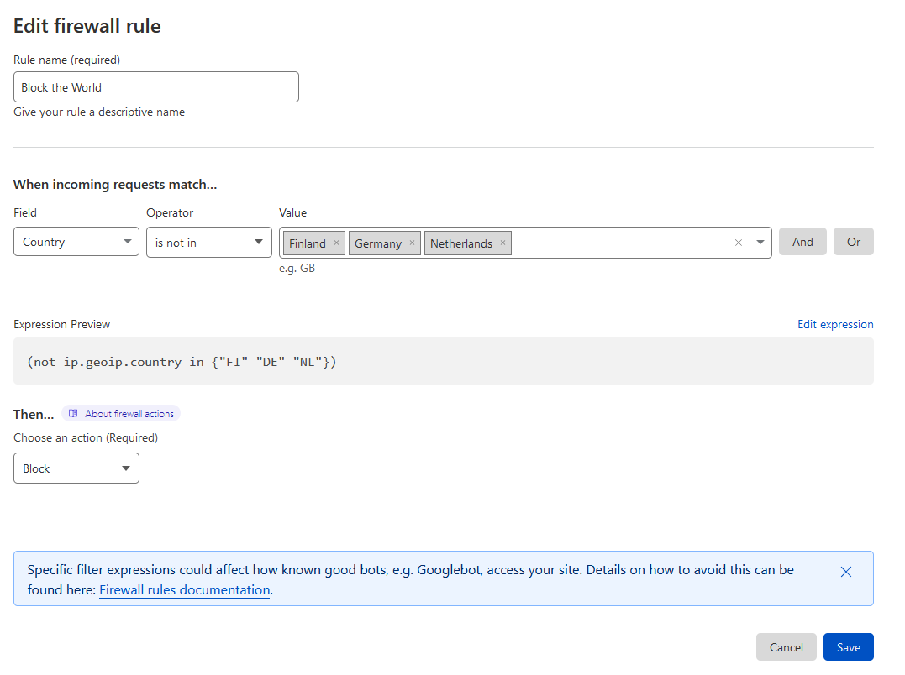
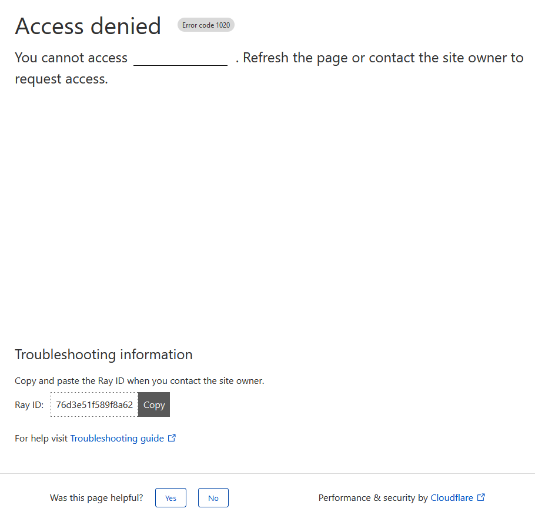

# {{ $frontmatter.title }}

## Cloudflare WAF (Web Application Firewall)

The Cloudflare Web Application Firewall (WAF) provides both automatic protection from vulnerabilities and the
flexibility to create custom rules.

In your Cloudflare Dashboard:

- Select the *WAF* Sub-Menu under the Security Menu  
  

- Create your Rules, who can and who can't access your domain  
  
  In this example only users from ```Finland```, ```Germany``` and ```Netherlands``` can access the domain.

- Users from other Countries on the other hand will see the following site/message from cloudflare  
  

## Cloudflare IP Ranges

From now on thwe only IP's that are directly connecting to the domain are the ones from cloudflare
| [IPv4](https://www.cloudflare.com/ips-v4) | [IPv6](https://www.cloudflare.com/ips-v6) |
|---------------- |-----------------|
| 103.21.244.0/22 | 2400:cb00::/32 |
| 103.22.200.0/22 | 2606:4700::/32 |
| 103.31.4.0/22 | 2803:f800::/32 |
| 104.16.0.0/13 | 2405:b500::/32 |
| 104.24.0.0/14 | 2405:8100::/32 |
| 108.162.192.0/1 | 2a06:98c0::/29 |
| 131.0.72.0/22 | 2c0f:f248::/32 |
| 141.101.64.0/18 | |
| 162.158.0.0/15 | |
| 172.64.0.0/13 | |
| 173.245.48.0/20 | |
| 188.114.96.0/20 | |
| 190.93.240.0/20 | |
| 197.234.240.0/2 | |
| 198.41.128.0/17 | |
|-------------------------------------------|-----------------|

## Delete previous 80/443 Firewall Rules

Run the following command to see all current rules

``` bash
sudo ufw status numbered
```

> ```
> Status: active
>  
>      To                         Action      From
>      --                         ------      ----
> [ 1] 22/tcp                     ALLOW IN    Anywhere                  
> [ 2] 25/tcp                     ALLOW IN    Anywhere                   # accept email
> [ 3] 80/tcp                     ALLOW IN    Anywhere                  
> [ 4] 443/tcp                    ALLOW IN    Anywhere                  
> [ 5] 22/tcp (v6)                ALLOW IN    Anywhere (v6)             
> [ 6] 25/tcp (v6)                ALLOW IN    Anywhere (v6)              # accept email
> [ 7] 80/tcp (v6)                ALLOW IN    Anywhere (v6)             
> [ 8] 443/tcp (v6)               ALLOW IN    Anywhere (v6)
> ```
Now delete the rules for port 80 and port 443

``` bash
sudo ufw delete 3
sudo ufw delete 4
sudo ufw delete 7
sudo ufw delete 8
```

## Block Port 80

The HTTP Port 80 can be closed, because cloudflare should redirect all incoming traffic to HTTPS Port 443

```
sudo ufw deny 80/tcp comment 'deny HTTP traffic out' # Deny HTTP
```

## Allow only from cloudflare IP's on 443

Users that somehow find out the IP address of the Server could then theoretically connect to the Server using <
IP-ADDRESS>:443
To prevent this we can only allow ip addresses which belong to cloudflare to connect to this port

``` bash
for ip in `curl https://www.cloudflare.com/ips-v4`; do sudo ufw allow from $ip to any port 443 comment 'allow Cloudflare IPs'; done
```

Same for IPv6

``` bash
for ip in `curl https://www.cloudflare.com/ips-v6`; do sudo ufw allow from $ip to any port 443 comment 'allow Cloudflare IPs'; done
```

StackOverflow:
> Q:  How does ufw handle conflicting rules?
> > A: ufw does not "handle the conflicts" in any way, it just puts the rules into an iptables chain which follows the
> > first-match policy.
> > **So if a packet matches a rule which drops it, it will be dropped regardless of any other matching rules which may
follow.**

You should also tell ufw what to do if none of the previous rules match.
In that case we want ufw to deny the connection

``` bash
sudo ufw deny 443/tcp comment 'deny HTTPS traffic outside of Cloudflare'
```

---
Sources:  
[IP Ranges](https://www.cloudflare.com/ips/)  
[How does ufw handle conflicting rules?](https://askubuntu.com/questions/323544/how-does-ufw-handle-conflicting-rules)  
[How to block specific IP range in ufw?](https://askubuntu.com/questions/851785/how-to-block-specific-ip-range-in-ufw)
