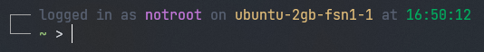

# Add Date and Time to the ```history``` command

Open the ```.bashrc``` file in your preferred text editor.

``` bash
nano ~/.bashrc
```

And then add the following line to the end of the file

``` bash
export HISTTIMEFORMAT="%F %T "
```
::: info
> %F –> shows Date in the format ‘YYYY-M-D’ (Year-Month-Day)  
> %T –> shows Time in the format ‘HH:MM:S’ (Hour:Minute:Seconds)
:::

# Custom Bash Prompt



Create the file ```.bash_prompt``` and open in in a text editor

``` bash
nano ~/.bash_prompt
```

Paste the following code inside it

``` bash
### PS1 SETTINGS =======================================================

# show more git info in PS1
export GIT_PS1_SHOWDIRTYSTATE=true
export GIT_PS1_SHOWUNTRACKEDFILES=true
export GIT_PS1_SHOWSTASHSTATE=true

# colors
export PS1_GREY="\[$(tput bold; tput setaf 0)\]"
export PS1_GREEN="\[$(tput bold; tput setaf 2)\]"
export PS1_YELLOW="\[$(tput bold; tput setaf 3)\]"
export PS1_MAGENTA="\[$(tput bold; tput setaf 5)\]"
export PS1_CYAN="\[$(tput bold; tput setaf 6)\]"
export PS1_WHITE="\[$(tput bold; tput setaf 7)\]"
export PS1_RESET="\[$(tput sgr0)\]"

BRACKET_COLOR="\[\033[38;5;35m\]"
CLOCK_COLOR="\[\033[38;5;35m\]"
JOB_COLOR="\[\033[38;5;33m\]"
PATH_COLOR="\[\033[38;5;33m\]"
LINE_BOTTOM="\342\224\200"
LINE_BOTTOM_CORNER="\342\224\224"
LINE_COLOR="\[\033[38;5;248m\]"
LINE_STRAIGHT="\342\224\200"
LINE_UPPER_CORNER="\342\224\214"
END_CHARACTER="|"
FIRST_LINE="$LINE_COLOR$LINE_UPPER_CORNER$LINE_STRAIGHT$LINE_STRAIGHT"
SECOND_LINE="$LINE_COLOR$LINE_BOTTOM_CORNER$LINE_STRAIGHT$LINE_BOTTOM"
END_LINE="$LINE_COLOR$LINE_STRAIGHT$LINE_STRAIGHT$END_CHARACTER"
LOGGED_IN_USER="${PS1_MAGENTA}\u"
WORKING_DIR="${PS1_GREEN}\w"

TIME="$BRACKET_COLOR[$CLOCK_COLOR\t$BRACKET_COLOR]"

# function to set PS1
function _bash_prompt(){
    # git info
    local GIT_INFO=$(git branch &>/dev/null && echo "${PS1_CYAN}git${PS1_WHITE}:$(__git_ps1 '%s')")

    # add <esc>k<esc>\ to PS1 if screen is running
    # see man(1) screen, section TITLES for more
    if [[ "$TERM" == screen* ]]; then
        local SCREEN_ESC='\[\ek\e\\\]'
    else
        local SCREEN_ESC=''
    fi

    # finally, set PS1
    PS1="\n$FIRST_LINE ${PS1_GREY}logged in as $LOGGED_IN_USER ${PS1_GREY}on${PS1_YELLOW} \h ${PS1_GREY}at $CLOCK_COLOR\t ${GIT_INFO}\
        \n$SECOND_LINE $WORKING_DIR ${SCREEN_ESC}${PS1_WHITE}> "
}

# call _bash_prompt() each time the prompt is refreshed
export PROMPT_COMMAND=_bash_prompt
```

Then open the ```.bashrc``` file in your preferred text editor.

``` bash
nano ~/.bashrc
```

And then add the following line to the end of the file

``` bash
source ~/.bash_prompt
```
