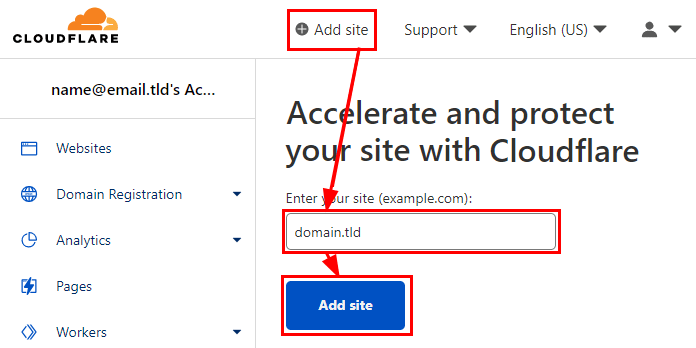
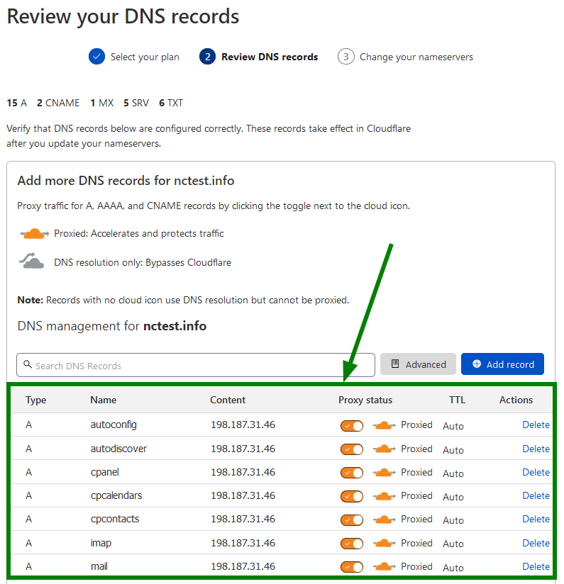
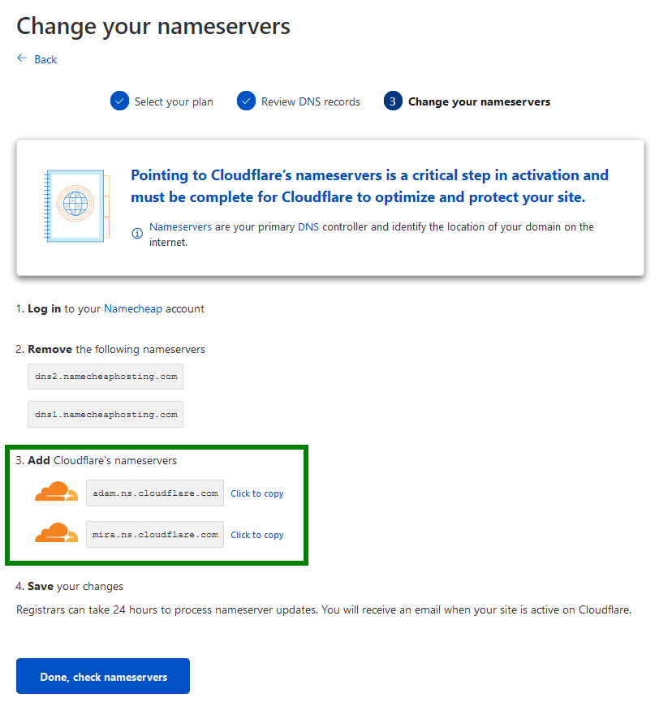
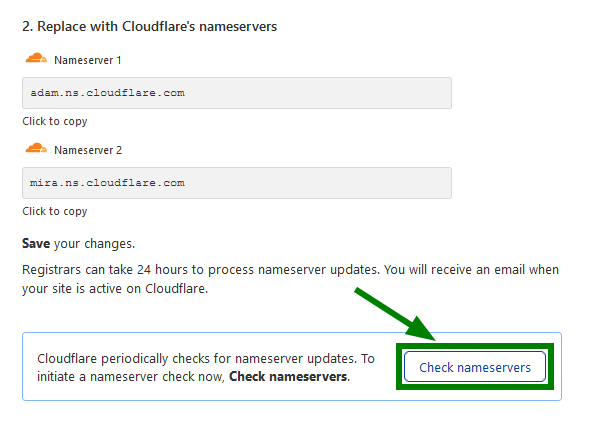
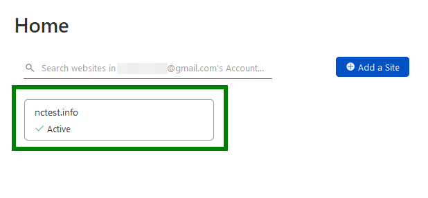

# {{ $frontmatter.title }}

## Introduction
Cloudflare operates as a global network of edge servers that acts as a mediator between user requests and origin
servers.

This positioning provides various benefits, including content delivery
acceleration ([CDN](https://www.cloudflare.com/learning/cdn/what-is-a-cdn/)), protection against
malicious
activity ([DDoS](https://www.cloudflare.com/learning/ddos/what-is-a-ddos-attack/), [Firewall](https://www.cloudflare.com/learning/ddos/glossary/web-application-firewall-waf/)),
traffic routing (Load balancing, Waiting Room), and more. By utilizing
strategically placed edge servers worldwide, Cloudflare can optimize content delivery, safeguard websites from malicious
traffic, and direct traffic based on predefined rules.

## Point a Domain to Cloudflare

Create an account on [Cloudflare.com](https://dash.cloudflare.com/sign-up).

- Click on Add site and enter your domain name to add it to Cloudflare:
  

- On the next screen, you will see the list of your existing host records. Be sure to double-check if the specified DNS
  records match the ones you previously had.
  
  If records shown in the list are correct, you can scroll down and click Continue.

- You will see nameservers (NS), needed for your domain to work with Cloudflare. Copy the values and change the
  nameservers at your domain registrar.
  
  After you specify new DNS records, propagation will start which can take up to 24 hours to fully complete.

- Once the nameservers are set up, return to the Cloudflare tab and click Check nameservers:
  
  If the nameservers have been successfully updated, you will see the Active status:
  

---
::: details Sources:  
[What is Cloudflare?](https://developers.cloudflare.com/fundamentals/get-started/concepts/what-is-cloudflare/)  
[How Cloudflare works](https://developers.cloudflare.com/fundamentals/get-started/concepts/how-cloudflare-works/)  
[How to set up DNS records for your domain in Cloudflare account](https://www.namecheap.com/support/knowledgebase/article.aspx/9607/2210/how-to-set-up-dns-records-for-your-domain-in-cloudflare-account/)  
[How to point a domain to Cloudflare](https://support.hostinger.com/en/articles/4741545-how-to-point-a-domain-to-cloudflare)  
[Step 1: Adding your domain to Cloudflare](https://community.cloudflare.com/t/step-1-adding-your-domain-to-cloudflare/64309)  
[IP Ranges](https://www.cloudflare.com/ips/)
:::
