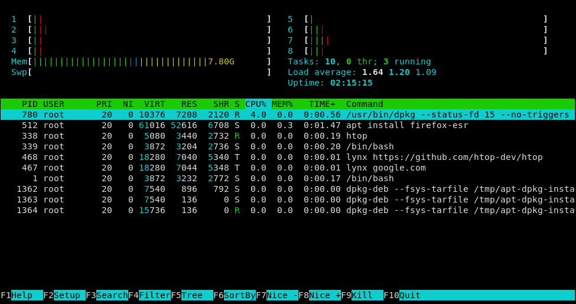

# {{ $frontmatter.title }}

# Introduction

A Collection of Software, which makes using the Linux Shell much easier/simpler

## [neofetch](https://github.com/dylanaraps/neofetch)

> Neofetch is a command-line system information tool written in bash 3.2+. Neofetch displays information about your
> operating system, software and hardware in an aesthetic and visually pleasing way.

``` bash
sudo apt-get install neofetch
```


::: tip
Which informations are shown can be customized in `${HOME}/.config/neofetch/config.conf`
:::

## [exa](https://github.com/ogham/exa)

> exa is a modern replacement for the venerable file-listing command-line program ls that ships with Unix and Linux
> operating systems, giving it more features and better defaults. It uses colours to distinguish file types and metadata.
> It knows about symlinks, extended attributes, and Git. And it’s small, fast, and just one single binary.

``` bash
sudo apt install exa
```

Set ```exa -la``` as an alias for ```ls```

``` bash
echo "alias ls='exa -la'" >> .bashrc
. ~/.bashrc
```


::: tip
You can even add icons with the `--icons` flag, if you have a font that supports icons, like [nerd font](https://github.com/ryanoasis/nerd-fonts/).
:::

## [bat](https://github.com/sharkdp/bat)

> A cat(1) clone with syntax highlighting and Git integration.

``` bash
sudo apt install bat
```

On Ubuntu the command is ```batcat``` imstead of ```bat```
Lets change that:

``` bash
echo "alias bat='batcat'" >> .bashrc
. ~/.bashrc
```


## [micro](https://github.com/zyedidia/micro)

> **micro** is a terminal-based text editor that aims to be easy to use and intuitive, while also taking advantage of
> the capabilities of modern terminals. It comes as a single, batteries-included, static binary with no dependencies; you
> can download and use it right now!

``` bash
sudo apt install micro
```


::: tip
unlike nano, micro uses keyboard shortcuts that you are probably familiar with from almost all graphical user interfaces
``` json
"Ctrl-s":  "Save",
"Ctrl-f":  "Find",
"Ctrl-n":  "FindNext",
"Ctrl-p":  "FindPrevious",
"Ctrl-z":  "Undo",
"Ctrl-y":  "Redo",
"Ctrl-c":  "CopyLine|Copy",
"Ctrl-x":  "Cut",
"Ctrl-k":  "CutLine",
"Ctrl-d":  "DuplicateLine",
"Ctrl-v":  "Paste",
"Ctrl-a":  "SelectAll",
"Ctrl-q":  "Quit",
```
:::

## [htop](https://htop.dev/)

> htop is a cross-platform interactive process viewer. htop allows scrolling the list of processes vertically and
> horizontally to see their full command lines and related information like memory and CPU consumption. Also system wide
> information, like load average or swap usage, is shown.

``` bash
sudo apt-get install htop 
```



## [thefuck](https://github.com/nvbn/thefuck)

> The Fuck is a magnificent app that corrects errors in previous console commands.

``` bash
sudo apt update
sudo apt install python3-dev python3-pip python3-setuptools
pip3 install thefuck --user
```
It is recommended that you place this command in your .bash_profile, .bashrc, .zshrc or other startup script:
``` bash
eval $(thefuck --alias)
```


## [fd](https://github.com/sharkdp/fd)

> fd is a program to find entries in your filesystem. It is a simple, fast and user-friendly alternative to find.

``` bash
sudo apt install fd-find
```

Note that the binary is called fdfind as the binary name fd is already used by another package


## [nvm](https://github.com/nvm-sh/nvm)

> nvm is a version manager for [node.js](https://nodejs.org/en/), designed to be installed per-user, and invoked
> per-shell. nvm works on any POSIX-compliant shell (sh, dash, ksh, zsh, bash), in particular on these platforms: unix,
> macOS, and windows WSL.

``` bash
TODO
```

## [tldr](https://github.com/tldr-pages/tldr)

> The tldr-pages project is a collection of community-maintained help pages for command-line tools, that aims to be a
> simpler, more approachable complement to traditional man pages.

``` bash
pip3 install tldr
```


